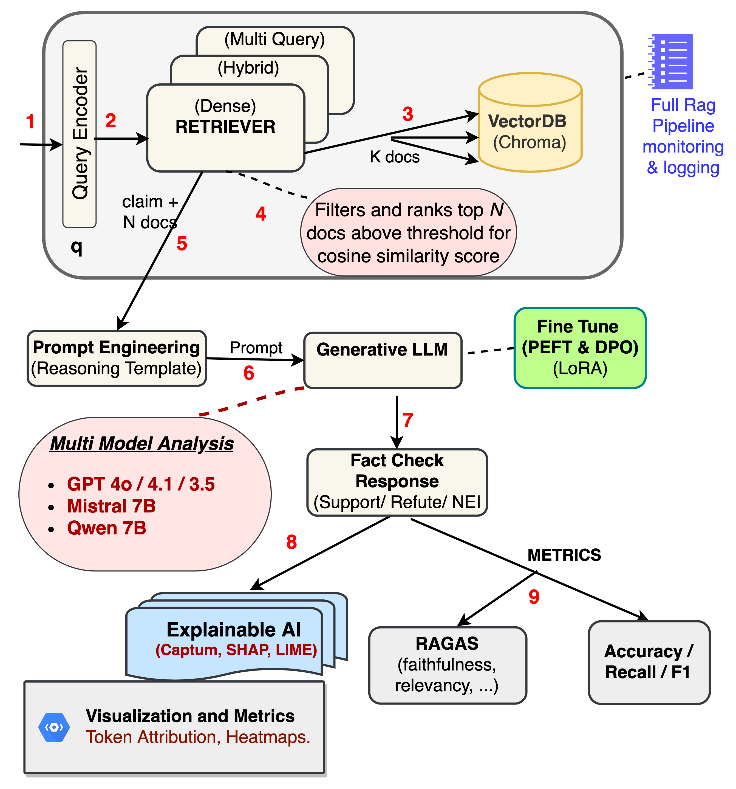
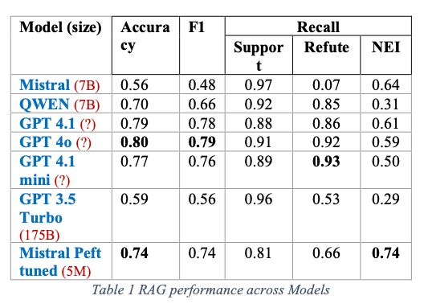
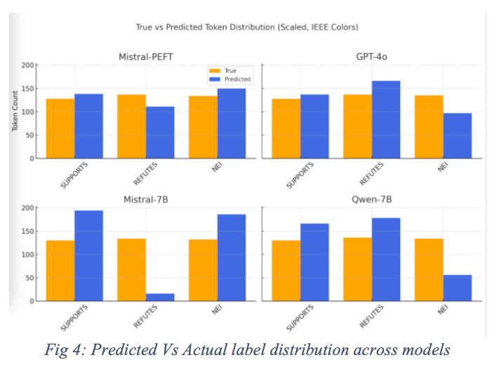

# InterpretableRAGFactCheck 

A modular, explainable Retrieval-Augmented Generation (RAG) pipeline for automated fact-checking on the FEVER dataset. 
Includes 
 - Multi-model evaluation (Mistral, Qwen, GPT 4.1, 4o, 3.5 Turbo) of RAG pipeline
 - PEFT & DPO fine-tuning (Mistral model) with significant improvements of accuracy (56% to 74%)
 - Token-level explainability with Captum, SHAP, and LIME.

### Submitted by
**Apple Analytics Team (1)**  
Saurav, Lahari, Savithri, Taniksha

📄 See [project report](https://github.com/sauravverma78/InterpretableRAGFactCheck/blob/main/Apple_Analytics_project_report.pdf) for detailed experimental results, methodology, and ablation findings.


## Introduction
This project shows that a retrieval-enhanced, interpretable fact-checking system can be both effective and insightful, with model selection, fine-tuning, and retrieval design - each  contributing significantly to its accuracy and transparency

#### RAG Pipeline Architecture


### Key Contributions and Implementation Highlights
- We develop an end-to-end RAG-based fact-checking system evaluated on the FEVER (1.0) dataset, with  integrated explainability using Captum, SHAP, LIME.
- We conduct a comparative evaluation of multiple LLMs under identical RAG settings.
  - Open Sourced: Mistral-7B, Qwen-7B
  - Close Sourced : GPT-4.1, 4.1 mini, 4o, 3.5 Turbo
- We fine-tune Mistral-7B using PEFT (LoRA/QLoRA) 
   -  Demonstrate significant accuracy improvements (from 56%) to 73.5% claim verification accuracy.
- We explore DPO fine-tuning for fact-checking, 
   - We provide one of the earliest experimental insights into its effectiveness in this domain.
- Integrate RAG with state-of-art RAGAS 
     - for additional metrices like Faithfulness, answer relevancy.
- We perform ablation studies on the below, analyzing their impact on  verification performance and explainability
  - retriever types, 
  - retriever threshold cut-offs, 
  - asynchronous retrieval, 
  - prompt engineering strategies, 
  - Performance on RAG vs standalone LLM

### PEFT / DPO tuned models 
Are available on Huggingface for reproducibility
 - PEFT tuned  https://huggingface.co/sauravverma78/mistral7bInstruct02_fever_trained
 - DPO on peft : https://huggingface.co/sauravverma78/mistral7bInstruct02_fever_dpo


## Directory Structure

```  
project/
│
├── src
│    ├── fine_tuning
│    │      ├── RAG_Mistral_PEFT_tuning_73pc_accuracy_COLAB.ipnyb (PEFT fine tuning Mistral 7B model - COLAB)
│    │      │
│    │      └── RAG_Mistral_DPO_Tuning.ipnyb (DPO Fine tuning Mistral 7B model - COLAB)
│    │
│    ├── misral
│    │      ├── RAG_Mistral_COLAB.ipnyb (RAG Pipiline for Mistral 7B model - COLAB)
│    │      │
│    │      └── **RAG_Mistral_LOCAL.ipnyb** (RAG Pipiline and ablation for Mistral 7B model - Local Macbook & start reading here)
│    │
│    ├── qwen
│    │      └── RAG_QWEN2_LOCAL.ipnyb (RAG Pipiline for QWEN 7B model - Local Macbook)
│    │      
│    │
│    └── openai
│           └── RAG_OPENAI_COLAB_and_LOCAL.ipnyb (RAG Pipiline for OPEN AI model's' - Macbook + COLAB both supported)         
│
│
├── Apple_Analytics_Project_report.pdf  (Project report detailing the work and study)
│
├── environments.yaml  (to create a local conda virtual env with all requisite packages)
│
├── README.md  (this file)
│
├── proposal 
│  	  └──── Apply_Analytics_Project_proposal.pdf  (Initial project proposal)
│
├── images 
  	  └──── *.png (images for readme.md file)  
```


## Environments and Accesses
### Two main environments:
- **Local**: Macbook Pro M3 with 128GB RAM and 40-core Neural Engine.
  - Used for running models (Mistral, Qwen2) and initial prototyping.
- **Cloud**: Google Colab PRO (paid) with A100 GPU.
  - Used  for computationally intensive tasks like model fine-tuning (PEFT/DPO)
  - RAG pipelines with OpenAI models and RAGAS computations

### Accesses
You would need following standard accesses (some free and some paid) to run the notebooks
- **Huggingface**
  - to download Mistral/Qwen models
  - To load / save Fine tuned models
- **Wandb.ai token**
  -  Required for APi access to https://api.wandb.ai internally when DPO Trainer starts
- **open ai key**
  - required to run GPT pipelines
- **Colab Pro**
  - To have a stable A-100 GPU access
- **Google drive**
  - for saving vector stores & model outputs for COLAB notebooks

## Setup and Execution notes
### Where to Start
#### **RAG_Mistral_LOCAL.ipnyb** contains the complete code and various ablation study and is a good starting point.
    - RAG_Mistral_COLAB.ipnyb contains the COLAB implementation and install notes.
- Refer to `qwen` and `openai` folders for respective implementations
- **fine_tuning** 
  - this package contains the PEFT and DPO fine tuning notebooks on MISTRAL 7B model on COLAB

### Mistral-7B locally setup (Macbook) using conda
```
# this creates a virtuall env named `ml` and installs packages including jupyter
conda env create -f environments.yaml
conda activate ml
jupyter notebook

# Then open the LOCAL notebooks
# Then refer to instructions in the Notebook itself.
# Change local path accordingly (where we store models, vector DB, etc)
```
###  Mistral-7B on COLAB
- Simply execute the First Cell in Notebook, this installs all the packages
  -  **Note** : During package install, Colab would ask for "restart" of session. Please do so. And run the pip install cell again.
-  Requires access to your local google drive.
-  Would need your HuggingFace Token (to download the models)

### We suggest running cell by cell manually to see the executions, as some steps are time consuming

### How to Execute

Each Notebook begins with details and notes required to get it working
- All the `*LOCAL*.ipnyb` notebooks were prepared on Macbook
- All the `*COLAB*.ipnyb` are for COLAB.
- Be sure to adjust any local paths in the notebook (e.g., for model checkpoints or DB folders).
- Recommend to manually run cell-by-cell as its necessary due to Colab memory resets or re-auth steps.


## Results 

#### RAG performance across models
###### Below are comparative results from different LLMs under our RAG pipeline:


###### Below are the predicted Vs actual token distribution plots for few models



